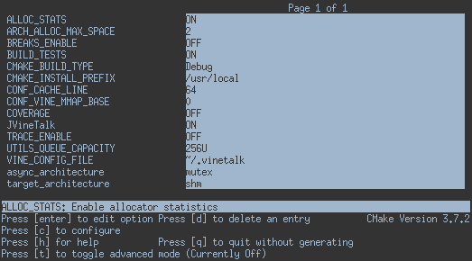

This library aims to implement the main communication layer between the
Application VMs and the Appliance VMs.

# Folder layout

* docs - Documentation
* examples - Usage examples of the code
* 3rdparty - Third-party libraries.
* include - Header files that expose the public interface
* src - Source code
    * core - The core implementation of the program/library
    * arch - The architectural specific implementations
    * utils: Contains helper modules, such as data structures, wrappers
      to external libraries, etc.
* tests - Contain the tests that should be run with `make test`

# Building

Vinetalk is built as a shared library(libvine.so), using cmake and make:

First build and navigate to your build folder:

<code>mkdir build;cd build</code>

You must then configure your build using ccmake or cmake directly:

## Configure with CCMake

Run <code>ccmake ..</code> in your build folder and press `c` once:

Every line correspond to a build option(see below for option descriptions).
To change/set an option press enter, this will toggle a Boolean flag or allow you to edit a string option.
For string press enter again to end string input.

Once you have configured your build, press `c` followed by `g`.

## Configure with CMake

To configure using, on the build folder you type:

<code>cmake [Configuration Options] ..</code>

### Configuration Options

| Option                    | Description                    |
|---------------------------|--------------------------------|
|-DBUILD_TESTS=ON&#124;OFF  | Build unit tests               |
|-DCOVERAGE=ON&#124;OFF     | Enable gcov coverage           |
|-DTRACE_ENABLE=ON&#124;OFF | Enable trace file creation     |
|-DCMAKE_BUILD_TYPE=Debug   | Produce debug symbols          |
|-Dasync_architecture=spin  | Method used to ensure ordering |
|-Dtarget_architecture=shm  | Method used to transfer data   |
## CCMake

Run <code>ccmake ..</code> in your build forder and press c:

## Build with Make

After configuring, run <code>make</code>

## Testing

After building with tests enabled, you can run tests with <code>make test</code>.

## Install

This is optional but simplifies building applications for/with VineTalk.
After a successful build, run <code>make install</code>, with root privileges.

## Using the Vine Talk Library

After a successful build your build directory will have a libvine.so file as well as
an include folder. Add your build path as a library path and link with vinetalk <code>-lvine</code>.
Also add the build/includes folder to your gcc include paths <code>-Ibuild/includes</code>.

# Configuration

In order to configure the vine_pipe endpoints, the user must provide
architecture specific options.

These configuration options are stored at ~/.vinetalk and follow the format
specified in utils/config.h.

The sections bellow specify the required keys for each supported vinetalk
architecture:

## shm

Shm implements the vinetalk API/protocol over a shared segment
(POSIX or ivshmem).

The required keys are the following:

shm_file: A file path specifying the shared segments file.

shm_size: The size of the shared segment in bytes.

Optional keys:

shm_trunc: A boolean (0,1) setting if the shm_file should be truncated
durring initialization.

shm_off: Start mmap from the given byte offset instead from 0.
Can be used to split a single shm to multiple vine_pipe instances.

shm_ivshmem: Boolean , set to 1 if running inside a Vm with ivshmem.

## tracer

Tracer implements an api that tracing vine_talk interface.

The required keys are the following:

log_buffer_size: The size of log buffer in bytes

# Design

[Graphical representation](docs/high_level.svg) by mavridis.

## 26-02-2016

As discussed on 26-02-2016 with bilas, mavridis, manospavlidakis,
nchrisos, and zakkak, we decided to implement a single work-queue per
application thread.  This queue must be single-producer/single-consumer.

Such a design significantly simplifies the code complexity in the
Application VM side, but might as well hinter the Appliance VM's
performance if the number of queues starts getting really high.

To improve performance, on the Appliance VM side we will adopt the
mechanisms used in the sockets' implementation where a server may serve
a big number of sockets efficiently.

## 24-02-2016

As discussed on 24-02-2016 with mavridis, manospavlidakis, nchrisos, and
zakkak, we decided the following steps:

1. Implement a single work-queue per Appliance VM.  This queue must be a
   multi-producer/single-consumer concurrent queue (preferably lock
   free).

   Such a design significantly simplifies the code complexity in the
   Appliance VM side, but might as well hinter performance.

2. If a single queue appears to hinter performance by becoming a
   bottleneck, we decided to experiment with `N` work-queues, where `N`
   is the number of physical cores available in the server.  Then, each
   VM can only use one out of the `N` queues based on its ID (we will
   probably use a simple hash function here).

## Concerns

* Interruption/event driven VS polling
* Atomics VS locks
