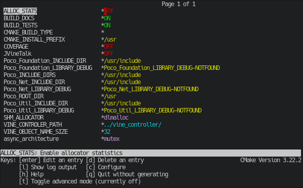

This library aims to implement the main communication layer between the
Application VMs and the Appliance VMs.

# Requirements

Arax requires the following packages:

- cmake
- make
- gcc + g++

Optionaly:

- ccmake (configuration ui)
- libpoco (vdf tool)
- libncurses (vtop)
- doxygen (documentation)

## ArchLinux

    sudo pacman -S cmake # poco ncurses doxygen 

## CentOS

    sudo yum install cmake # poco-devel poco-foundation poco-net ncurses-devel doxygen

## Ubuntu

    sudo apt-get install cmake # cmake-curses-gui libpoco-dev libncursesw5-dev libncurses-dev doxygen

# Folder layout

* misc - Miscellaneous files.
* Java - Java wrappers for Arax
* 3rdparty - Third-party libraries.
* include - Header files that expose the public interface
* noop - No-op kernel/application used in testing
* src - Source code
    * core - The core implementation of the program/library
    * arch - The architectural specific implementations
    * utils: Contains helper modules, such as data structures, wrappers
      to external libraries, etc.
* tests - Contain the tests that should be run with `make test`
* tools - Scripts related to testing and releasing Arax
* vdf - Visual Data Free, http dashboard, showing Arax state
* araxtop - Similar to htop but for arax
* araxgrind - CLI Memory checker tool

# API Documentation

To generate documentation see the `Build doxygen documentation` section below.

# Building

Arax is built as a shared library(libarax.so), using cmake and make:

First build and navigate to your build folder:

    mkdir build;cd build

You must then configure your build using ccmake or cmake directly:

## Configure with CCMake

Run `ccmake ..` in your build folder and press `c` once:

Every line corresponds to a build option(see below for option descriptions).
To change/set an option press enter, this will toggle a Boolean flag or allow you to edit a string option.
For string press enter again to end string input.
Pressing `t` will toggle Advanced options.

Once you have configured your build, press `c` followed by `g`.

## Configure with CMake

To configure using cmake, on the build folder type:

    cmake [Configuration Options] ..

### Configuration Options

#### Basic Options
| Option                         | Type       | Description                                                                      | Defaut Value                   |
|--------------------------------|------------|----------------------------------------------------------------------------------|--------------------------------|
|                    ALLOC_STATS |       BOOL | Enable allocator statistics                                                      | OFF                            |
|           ARAX_CONTROLLER_PATH |     STRING | Arax Controller path                                                             | AUTODETECTED                   |
|          ARAX_OBJECT_NAME_SIZE |     STRING | Bytes reserved for AraxObject names                                              | 32                             |
|                     BUILD_DOCS |       BOOL | Build documentation                                                              | ON                             |
|                    BUILD_TESTS |       BOOL | Build unit tests                                                                 | ON                             |
|                       COVERAGE |       BOOL | Enable coverage reports                                                          | OFF                            |
|                     JAVA_WRAPS |       BOOL | Build java Arax wrappers                                                         | OFF                            |
|                  SHM_ALLOCATOR |     STRING | Shared Memory allocator                                                          | dlmalloc                       |
|             async_architecture |     STRING | Mechanism used for async API                                                     | mutex                          |

#### Advanced Options
| Option                         | Type       | Description                                                                      | Defaut Value                   |
|--------------------------------|------------|----------------------------------------------------------------------------------|--------------------------------|
|               ARAX_CONFIG_FILE |     STRING | Arax configuration file                                                          | ~/.arax                        |
|             ARAX_DATA_ANNOTATE |       BOOL | Annotate arax_data for leak detection                                            | OFF                            |
|                ARAX_DATA_TRACK |       BOOL | Track where arax_data objects are allocated                                      | OFF                            |
|                    ARAX_KV_CAP |     STRING | Capacity of utils_kv_s instances                                                 | 32                             |
|             ARAX_PROC_MAP_SIZE |     STRING | Number of processes that can use Arax                                            | 1024                           |
|                 ARAX_REF_DEBUG |       BOOL | Enable reference inc/dec prints                                                  | OFF                            |
|            ARAX_THROTTLE_DEBUG |       BOOL | Enable Throttle inc/dec prints                                                   | OFF                            |
|           ARAX_THROTTLE_ENABLE |       BOOL | Enable Throttle                                                                  | ON                             |
|            CONF_ARAX_MMAP_BASE |     STRING | Non zero values set shared segment mmap address                                  | 0                              |
|                CONF_CACHE_LINE |     STRING | CPU Cacheline size                                                               | 64                             |
|                  MMAP_POPULATE |       BOOL | Populate mmap(good for many/larg tasks)                                          | OFF                            |
|           UTILS_QUEUE_CAPACITY |     STRING | Maximum number tasks in a task queue (Up to 65536), MUST BE power of 2           | 256U                           |
|               UTILS_QUEUE_MPMC |       BOOL | Add lock to allow multimple producers                                            | ON                             |
|            target_architecture |     STRING | Target architecture (shm)                                                        | shm                            |

## Build with Make

After configuring, run `make`

### Build doxygen documentation

After configuring, run `make doc`
The path to the generated documentation will be printed at completion.

## Testing

After building with tests enabled, you can run tests with `make test`.

## Install

Arax can be 'installed' in two ways.
System Wide install is the recomened method if deploying on a dedicated machine and have root/sudo access.
User Specific installation is recomended if deploying in a shared machine with multiple users and dont have root/sudo access.

### System Wide Install

After a successful build, run `make install`, with root privileges.

### User Specific Install

You can use the LD_LIBRARY_PATH eviroment variable to load Arax from the build path.

    export LD_LIBRARY_PATH=<Arax build path>

To find the apropriate Arax build path, run:

    make AraxBuildPath

## Using the Arax Library

After a successful build your build directory will have a libarax.so file as well as
an include folder. Add your build path as a library path and link with Arax `-larax`.
Also add the build/includes folder to your gcc include paths `-Ibuild/includes`.

# Configuration

In order to configure the arax_pipe endpoints, the user must provide
architecture specific options.

These configuration options are stored at ~/.arax and follow the format
specified in utils/config.h.

The sections bellow specify the required keys for each supported Arax
architecture:

## Vdf

Vdf is a program located at the examples folder, allowing run time inspection of allocator statistics and breakdowns(and more to come).
To be built it requires the Poco framework to be installed.

After running it spawns a web server at localhost:8888.
The web ui allows inspection of allocator statistics and breakdowns.

## shm

Shm implements the Arax API/protocol over a shared segment
(POSIX or ivshmem).

### Required Configuration Keys

| Option   | Description                                      |
|----------|--------------------------------------------------|
| shm_file | A file path specifying the shared segments file. |
| shm_size | The size of the shared segment in bytes.         |

### Optional Configuration Keys

| Option      | Description                                                                                                             |
|-------------|-------------------------------------------------------------------------------------------------------------------------|
| shm_trunc   | A boolean (0,1) setting if the shm_file should be truncated during initialization.                                      |
| shm_off     | Start mmap from the given byte offset instead from 0.Can be used to split a single shm to multiple arax_pipe instances. |
| shm_ivshmem | Boolean , set to 1 if running inside a Vm with ivshmem.                                                                 |

## VDF

VDF is a monitoring tool for Arax, exposing statistics through a web interface.
It accepts the following arguements:

| Arguement          | Description                                                           |
|--------------------|-----------------------------------------------------------------------|
| embed              | Skips html and head tags from output, allowing output to be embeded   |
| noconf             | Dont show configuration section                                       |
| nosize             | Dont show struct sizes section                                        |
| noalloc            | Dont show allocation statistics                                       |
| noobj              | Dont show object statistics                                           |
| nobreak            | Dont show breakdowns                                                  |

# Debuging and Core dumps

As Arax uses shared segments for its state it is usefull to capture their state for post-mortem analysis.

To do this run:

``
echo 0xf > /proc/self/coredump_filter
``

This will result in big coredumps as they will include the contents of the shared segment at the time of crash.
As such it is recomended to use the smallest possible shm_size posible.

# Contributors[^contribs]
[^contribs]: As of 2021-09-13

|                      Name |     Email at ics.forth.gr |
|---------------------------|---------------------------|
|       Christi Symeonidou  |                  chsymeon |
|         Dimitris Samatas  |                   samatas |
|         Foivos S. Zakkak  |                    zakkak |
|   Kavroulakis Alexandros  |                    kavros |
|         Manos Pavlidakis  |                 manospavl |
|         Savas Kiaourtzis  |                  savaskia |
|         Stelios Mavridis  |                  mavridis |

